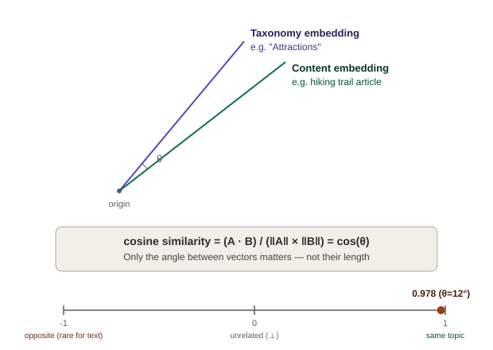
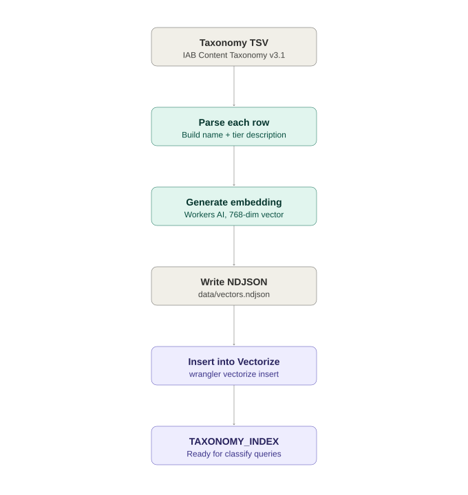
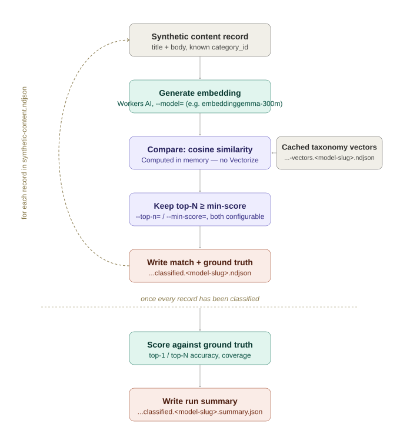

# IAB Taxonomy Classifier

A toolkit for embedding the [IAB Tech Lab Content Taxonomy](https://iabtechlab.com/standards/content-taxonomy/) with [Cloudflare Workers AI](https://developers.cloudflare.com/workers-ai/) and evaluating which embedding model classifies content into it most accurately, before committing to one for production use.

## How it works

Classification here isn't rule-based keyword matching — it's semantic similarity between vector embeddings.

**1. Taxonomy categories are embedded once per model.** Every category in the IAB Content Taxonomy (name + tier hierarchy, e.g. `"Amusement and Theme Parks: Attractions > Amusement and Theme Parks"`) is converted into a vector using a Workers AI embedding model, and cached to disk (see [Seed the taxonomy](#seed-the-taxonomy)) — optionally also loaded into a [Vectorize](https://developers.cloudflare.com/vectorize/) index (`TAXONOMY_INDEX`) for future use. This only needs to be redone if the taxonomy changes or a new embedding model is under evaluation.

**2. Synthetic ground-truth content is generated per category.** For every taxonomy category, a fictional publisher webpage sample (`title` + `body`) that should classify under that exact category is generated once (see [Generate synthetic sample content](#generate-synthetic-sample-content)) — giving every embedding model under test the same known-correct answers to be scored against.

**3. Each candidate embedding model is scored against that ground truth.** A sample's `title` + `body` is embedded with the same model used to embed the taxonomy, then compared against every cached taxonomy vector via cosine similarity — see [Why cosine similarity](#why-cosine-similarity) below for what that means and why it's the right metric here. Whether the sample's own known category comes back as the top match (or anywhere in the top-N) measures that model's raw classification accuracy (see [Classify the generated samples](#classify-the-generated-samples-offline-evaluation)).

**4. Accuracy is compared across models.** Each run's summary — top-1/top-N accuracy, and how much of that survives a confidence threshold — is written out per model (and per vector size, since some models support multiple dimensions), so models can be ranked against each other (see [Embedding models](#embedding-models)).

### Why cosine similarity

Embeddings turn text into a vector of numbers — a point in a many-dimensional space where nearby points mean similar meaning. The question "how similar are these two pieces of text?" becomes "how similar are these two vectors?", and there's more than one way to answer that:

- **Cosine similarity** measures the *angle* between two vectors: `cos(θ) = (A · B) / (‖A‖ × ‖B‖)`. It ignores each vector's length entirely — only the direction matters.
- Euclidean distance and raw dot product, by contrast, are both sensitive to vector *magnitude* — and embedding magnitude tends to track things like text length or the model's confidence rather than topic, which would skew results (a longer article isn't "more about" its topic than a short one).

That makes cosine similarity the standard choice for comparing text embeddings, and it's why this project uses it consistently:

- **`scripts/classify-synthetic-data.ts`** is what actually runs these comparisons — it doesn't touch Vectorize at all, computing cosine similarity itself, in memory, via `cosineSimilarity()` in [`scripts/lib/workers-ai.ts`](scripts/lib/workers-ai.ts).
- **The `TAXONOMY_INDEX` Vectorize index** is created with `--metric=cosine` too (see [Create the Vectorize index](#create-the-vectorize-index)), so a future consumer's `query()` calls would compute it the same way Cloudflare-side, consistent with the offline evaluation above.

**Both vectors must come from the same model — and the same dimensionality.** Cosine similarity assumes the two vectors already live in the same coordinate space — that "dimension 37" means the same kind of thing for both. That's true for two vectors from the *same* model at the *same* vector size, since it always maps text through the same learned geometry, but not across models — each one learns its own internal geometry during training, so nothing forces "dimension 37" in `bge-base-en-v1.5` to align with "dimension 37" in `embeddinggemma-300m`, even though both happen to output 768 numbers. It's also not true across dimensions of the *same* Matryoshka-capable model: a vector truncated to 256 dims isn't in the same space as that model's native 1024-dim output. Comparing mismatched vectors still produces *a number* — nothing crashes, since the lengths match — but that number is meaningless, not just "less accurate." This is why taxonomy vectors are cached per model *and* per dimensions rather than in one shared file (`taxonomyVectorsPathForModel()` → `data/content-taxonomy-3.1-vectors.<model-slug>.<dimensions>d.ndjson`), and why `seed-taxonomy.ts` and `classify-synthetic-data.ts` both take a single `--model=`/`--dimensions=` pair that applies to *both* sides of the comparison, rather than letting content and taxonomy embeddings drift to different models or sizes independently.

In practice, scores for these embedding models stay positive rather than spanning the full −1 to 1 range (embeddinggemma-300m's ranged roughly 0.24–0.66 across the synthetic dataset; bge-base-en-v1.5's ran higher, ~0.6–0.71) — which is why `classify-synthetic-data.ts`'s min-score default is [calibrated per model](#classify-the-generated-samples-offline-evaluation) rather than reusing a single fixed threshold.



### Diagrams

**Taxonomy seeding** (run once per model under evaluation):



**Offline synthetic-data classification** (evaluates model accuracy — see [Classify the generated samples](#classify-the-generated-samples-offline-evaluation)):



## Prerequisites

- [Node.js](https://nodejs.org/) 18 or later
- A [Cloudflare account](https://dash.cloudflare.com/sign-up)
- [Wrangler CLI](https://developers.cloudflare.com/workers/wrangler/) (included as a dev dependency)

## Getting started

```bash
npm install
```

Log in to Cloudflare (first time only):

```bash
npx wrangler login
```

### Configure environment variables

Copy `.env.example` to `.env` and fill in your credentials:

```bash
cp .env.example .env
```

| Variable | Description |
|---|---|
| `CLOUDFLARE_ACCOUNT_ID` | Your Cloudflare account ID |
| `CLOUDFLARE_API_TOKEN` | API token with Workers AI + Vectorize permissions |
| `EMBEDDING_MODEL` | Optional. Default Workers AI embedding model for `scripts/seed-taxonomy.ts` and `scripts/classify-synthetic-data.ts` — falls back to `@cf/google/embeddinggemma-300m` if unset |
| `EMBEDDING_DIMENSIONS` | Optional. Default vector size to expect from `EMBEDDING_MODEL` — falls back to `768` if unset |
| `ANTHROPIC_API_KEY` | Only needed for [generating synthetic sample content](#generate-synthetic-sample-content) — get one from the [Anthropic Console](https://console.anthropic.com/settings/keys) |

`EMBEDDING_MODEL`/`EMBEDDING_DIMENSIONS` only set the *default* for `scripts/seed-taxonomy.ts` and `scripts/classify-synthetic-data.ts` (see [Seed the taxonomy](#seed-the-taxonomy) and [Classify the generated samples](#classify-the-generated-samples-offline-evaluation)) — each script's `--model=`/`--dimensions=` flags override it per run, so you can classify against several models without editing `.env` between runs. The deployed worker's model is configured separately, via its own `EMBEDDING_MODEL` in `wrangler.jsonc`.

### Create the Vectorize index

This step is optional for the offline evaluation workflow below, which reads cached taxonomy vectors straight from disk — create this if you want the seeded vectors also loaded into a live [Vectorize](https://developers.cloudflare.com/vectorize/) index (e.g. for a future classification endpoint). The index name must match `index_name` for the `TAXONOMY_INDEX` binding in `wrangler.jsonc`:

```bash
npx wrangler vectorize create iab-content-taxonomy --dimensions=768 --metric=cosine
```

Use `--dimensions=` matching whichever embedding model you plan to seed with (see [Seed the taxonomy](#seed-the-taxonomy)) — `768` matches the default, `@cf/baai/bge-base-en-v1.5`.

### Seed the taxonomy

Every embedding model under evaluation needs its own vector embeddings for the full IAB taxonomy before it can be scored (see [Classify the generated samples](#classify-the-generated-samples-offline-evaluation)). A standalone script reads the official taxonomy TSV, calls the Workers AI API to generate embeddings, and writes them to `data/content-taxonomy-3.1-vectors.<model-slug>.<dimensions>d.ndjson` — named after both the model and its vector size so vectors from different embedding models, or the same Matryoshka-capable model at a different size, never collide.

**1. Run the seed script**

The taxonomy file is already included at `data/content-taxonomy-3.1.tsv` (IAB Content Taxonomy v3.1). Run:

```bash
npx tsx scripts/seed-taxonomy.ts
```

```bash
npx tsx scripts/seed-taxonomy.ts --model=@cf/baai/bge-base-en-v1.5 --dimensions=768
```

The model and its vector size are `--model=`/`--dimensions=` flags, defaulting to `EMBEDDING_MODEL`/`EMBEDDING_DIMENSIONS` in `.env` if set, otherwise `@cf/google/embeddinggemma-300m` at `768` (the same defaults `classify-synthetic-data.ts` uses, shared via `scripts/lib/workers-ai.ts`). The script processes each taxonomy row sequentially, embedding the category name and tier path (e.g. `Amusement and Theme Parks: Attractions > Amusement and Theme Parks`). Progress is logged every 50 rows. Output is written incrementally to `data/content-taxonomy-3.1-vectors.<model-slug>.<dimensions>d.ndjson` as newline-delimited JSON, so a partial run isn't lost if the script is interrupted. This file isn't gitignored — commit it once generated so others don't have to re-run the embedding pass.

> **Note:** With ~700 categories and one API call per row, processed sequentially, the full run takes several minutes. Rate-limit responses (HTTP 429) are retried automatically; any rows that still fail after retries are listed in the summary at the end.

**2. Load embeddings into Vectorize**

Once `data/content-taxonomy-3.1-vectors.<model-slug>.<dimensions>d.ndjson` has been generated, insert the vectors into the `iab-content-taxonomy` index:

```bash
npx wrangler vectorize insert iab-content-taxonomy --file=data/content-taxonomy-3.1-vectors.cf-baai-bge-base-en-v1-5.768d.ndjson
```

Verify the import:

```bash
npx wrangler vectorize get iab-content-taxonomy
```

The vector count should match the number of rows in the taxonomy file (minus any that failed after retries).

### Local development

```bash
npx wrangler dev
```

The worker runs at `http://localhost:8787`. The `TAXONOMY_INDEX` Vectorize binding is configured with `remote: true` in `wrangler.jsonc`, so it reaches your real Cloudflare account even in local dev. There's no classification endpoint on the worker itself yet — classification quality is currently evaluated entirely offline (see [Classify the generated samples](#classify-the-generated-samples-offline-evaluation)); this scaffold is here for whatever live endpoint gets built on top of the seeded taxonomy index next.

### Deploy

```bash
npx wrangler deploy
```

### Generate synthetic sample content

For training or evaluating a content classifier, `scripts/generate-synthetic-data.ts` calls the Anthropic API (Claude Haiku 4.5) once per taxonomy category to generate one fictional publisher webpage sample — a `title`, `body`, fictional `publisher_name`, and a short list of `keywords` summarizing the content — that should classify under that exact category. Output is written as NDJSON to `data/synthetic-content.ndjson`.

This is independent of the Workers AI / Vectorize setup above — it reads categories straight from `data/content-taxonomy-3.1.tsv` and only needs `ANTHROPIC_API_KEY` set in `.env`, so you can generate it any time, even before completing that setup.

Try it on a few categories first:

```bash
npm run generate:synthetic -- --limit=5
```

Then run it for all ~700 categories:

```bash
npm run generate:synthetic
```

By default this uses Claude Haiku 4.5 — it's the cheapest and fastest Claude model, which fits this job well since each request is short, templated, and doesn't need deep reasoning; generating all ~700 samples costs well under $1. Override the model with `--model=` (or set `ANTHROPIC_MODEL` in `.env`) if you want higher-nuance samples at a higher cost:

```bash
npm run generate:synthetic -- --model=claude-sonnet-5
```

Notes:

- **Resumable** — re-running skips categories already present in `data/synthetic-content.ndjson`, so an interrupted run can just be re-run.
- **Fails fast on a bad API key or unknown model** — the script checks both before starting, and aborts immediately (instead of looping through every category) if Anthropic rejects it mid-run.
- **Sensitive categories** (e.g. under "Sensitive Topics", "Crime", "War and Conflicts") are generated as neutral, non-graphic, journalistic-style content — topically relevant for classification without graphic depiction. Refusals and errors are logged to `data/synthetic-content.failures.ndjson` rather than retried.
- Runs 8 requests concurrently by default (see `CONCURRENCY` in the script).

To start over:

```bash
npm run clean:synthetic
```

Removes `data/synthetic-content.ndjson` and `data/synthetic-content.failures.ndjson` so the next run regenerates everything from scratch. The taxonomy files are untouched.

#### Summarize the generated samples

`scripts/summarize-synthetic-data.ts` prints one line per record in `data/synthetic-content.ndjson` — category ID, category name, keywords, and a short snippet of the generated body — so you can eyeball coverage and quality without opening the raw NDJSON.

```bash
npm run summarize:synthetic
```

```
154   Malls & Shopping Centers   [shopping malls, retail expansion, mall renovation]   Westbrook Village Mall announced the grand opening...
153   Historic Site and Landmark Tours   [historic architecture, renaissance estate, guided tours]   The Greystone Manor, built in 1887, stands as one...
179   Bars & Restaurants   [gastropub, restaurant opening, craft cocktails]   The Copper Kettle, a highly anticipated new gastropub...
```

The full run prints one line per generated category (up to ~700) followed by a total count, so pipe it through `less` or redirect to a file if you want to page through it: `npm run summarize:synthetic > data/synthetic-content.summary.txt`.

#### Classify the generated samples (offline evaluation)

`scripts/classify-synthetic-data.ts` evaluates classification quality without touching Vectorize or the deployed worker at all. For every record in `data/synthetic-content.ndjson` it:

1. Embeds the record's `title` + `body` with a Workers AI embedding model (via direct REST calls, same as the seed script).
2. Compares that vector against the IAB taxonomy embeddings using cosine similarity, computed locally in-memory.
3. Keeps the top-N nearest categories that clear a configurable minimum score.
4. Writes one NDJSON line per record with the record's known (ground-truth) category alongside the matches found, so you can measure how often the classifier's top match — or any of its top-N — agrees with the category the sample was generated for.
5. Writes a single JSON summary scoring the whole run against that ground truth.


See [Why cosine similarity](#why-cosine-similarity) for what that comparison actually measures and why it's the right one for embeddings.

```bash
npm run classify:synthetic
```

```bash
npm run classify:synthetic -- --model=@cf/baai/bge-base-en-v1.5 --top-n=3 --min-score=0.6 --limit=50
```

| Flag | Default | Meaning |
|---|---|---|
| `--model=` | `@cf/google/embeddinggemma-300m` | Workers AI embedding model id |
| `--dimensions=` | `768` | Expected embedding vector size for `--model=` |
| `--top-n=` | `5` | Max taxonomy matches kept per record |
| `--min-score=` | `0.3` | Minimum cosine similarity for a match to be kept |
| `--limit=` | (none) | Only classify the first N records — useful for a quick check |

`--model=`/`--dimensions=` default to `EMBEDDING_MODEL`/`EMBEDDING_DIMENSIONS` in `.env` if set, otherwise `@cf/google/embeddinggemma-300m` / `768` (shared with `seed-taxonomy.ts` via [`scripts/lib/workers-ai.ts`](scripts/lib/workers-ai.ts), so both scripts agree without the value being duplicated). 768 covers both models this project has been run against (`embeddinggemma-300m` and `bge-base-en-v1.5`) — override `--dimensions=` if you pick a `--model=` that embeds to a different size; a mismatch fails fast instead of silently writing bad vectors.

Per-record results are written to `data/synthetic-content.classified.<model-slug>.<dimensions>d.ndjson`, one line per record:

```json
{"taxonomy_id":"179","taxonomy_name":"Bars & Restaurants","matches":[{"id":"179","name":"Bars & Restaurants","score":0.612},{"id":"218","name":"Dining Out","score":0.554}]}
```

A single run summary is written alongside it to `data/synthetic-content.classified.<model-slug>.<dimensions>d.summary.json`:

```json
{
  "model": "@cf/google/embeddinggemma-300m",
  "generatedAt": "2026-08-24T21:56:20.078Z",
  "topN": 5,
  "minScore": 0.3,
  "totalRecords": 704,
  "classified": 704,
  "skippedEmbeddingErrors": 0,
  "accuracy": { "top1Correct": 528, "top1Rate": 0.75, "topNCorrect": 665, "topNRate": 0.9446 },
  "coverage": { "recordsWithAnyMatch": 678, "recordsWithAnyMatchRate": 0.963, "recordsWithCorrectMatchKept": 631, "recordsWithCorrectMatchKeptRate": 0.8963 }
}
```

- `accuracy` measures the embedding model's raw discriminative power — whether each sample's own ground-truth category is its single best match (`top1`) or anywhere in its top-N nearest matches (`topN`), ranked across *all* taxonomy categories, independent of `--min-score=`.
- `coverage` measures how usable the output actually is once `--min-score=` is applied — the same filtering used for `matches` in the NDJSON output: what fraction of records keep any match at all, and what fraction still keep their correct match after filtering.

Notes:

- **Taxonomy embeddings are cached per model *and* dimensions**, at `data/content-taxonomy-3.1-vectors.<model-slug>.<dimensions>d.ndjson` — the same file `seed-taxonomy.ts` writes (see [Seed the taxonomy](#seed-the-taxonomy)). If it already exists for the requested `--model=`/`--dimensions=` pair, it's reused as-is; otherwise this script embeds `data/content-taxonomy-3.1.tsv` once for that pair and caches the result there, so later runs with the same model and dimensions skip straight to classifying. Testing a Matryoshka-capable model at a different vector size (e.g. `--dimensions=256` instead of its native `1024`) builds and caches a separate taxonomy file rather than reusing the native-size one. Neither these caches nor the `synthetic-content.classified.*.ndjson`/`.summary.json` results are gitignored — commit them if you want the results available without re-running the embedding pass.
- **The default min-score (0.3) is calibrated for `embeddinggemma-300m`**, whose cosine scores run lower than `bge-base-en-v1.5`'s (see the constant's comment in the script). Re-tune `--min-score=` if you switch models — a threshold tuned for one embedding model's score distribution won't transfer to another.
- Requires the same `CLOUDFLARE_ACCOUNT_ID` / `CLOUDFLARE_API_TOKEN` as the seed script.

## Embedding models

The embedding model is pluggable via `--model=`/`EMBEDDING_MODEL` (see [Seed the taxonomy](#seed-the-taxonomy) and [Classify the generated samples](#classify-the-generated-samples-offline-evaluation)), but only models in [Cloudflare Workers AI's catalog](https://developers.cloudflare.com/workers-ai/models/) can actually be used here — `scripts/lib/workers-ai.ts` calls that REST API exclusively. The table below tracks the models under evaluation for this classifier and whether each has been run yet.

### Why dimension size matters

An embedding vector's size is a number of floats, and every one of those floats has a real, ongoing cost:

- **It has to travel over the wire.** Every embed call sends text in and gets a vector back over HTTP; every classification compares that vector against the taxonomy. A 1024-dimension `float32` vector is 4KB; the same content at 256 dimensions is 1KB — a 4x cut in request/response payload size for every single embed and every comparison, with no code change beyond `--dimensions=`.
- **It has to be stored.** A Vectorize index holds one vector per taxonomy category (~700 of them) plus one per piece of content ever classified. Storage cost scales directly with vector size, so a 4x smaller vector is a ~4x smaller index.
- **It has to be searched.** Nearest-neighbor search (whether Vectorize's `query()` or this project's own `cosineSimilarity()`) does one multiply-and-add per dimension for every candidate vector compared. Fewer dimensions means less compute per comparison, which matters more as the taxonomy or the content index grows.

None of that is free, though — a smaller vector generally encodes less nuance, which is why the [Results, by dimension](#results-by-dimension) table below tracks accuracy separately per size rather than assuming smaller is a pure win. The goal is the smallest dimension count that doesn't give up much accuracy, not the smallest dimension count outright.

### What MRL is, and why it's the thing that makes this possible

Most embedding models are trained so that *only* their full native-size output is meaningful — every one of its numbers only makes sense in the context of all the others, so chopping the vector down to fewer dimensions after the fact (naive truncation) throws away information unpredictably and can badly degrade quality. BGE-M3's own docs warn against exactly this: truncating its 1024-dim output is not supported and degrades results (see its row in the table below).

**Matryoshka Representation Learning (MRL)** — named after Russian nesting dolls — is a training technique that fixes this by explicitly optimizing a model so that *every prefix* of its output vector (the first 64 numbers, the first 256, the first 512, ...) is *also* a valid, independently useful embedding on its own, ordered so the most important information comes first. The full-size vector isn't just "more precise" than a truncated one — the truncated ones are smaller dolls nested meaningfully inside it, each one a complete (if less detailed) embedding in its own right. That's what makes it safe to truncate an MRL-trained model's output to fewer dimensions and still get a usable, comparable embedding — something that isn't true of a non-MRL model like BGE-M3.

This is exactly why the "Native / MRL dimensions" column below matters more than a plain "output size" column would: a model can only usefully go low-dimension if it was actually *trained* with MRL for that — and even among MRL models, how many discrete sizes are documented/benchmarked (versus just "MRL is supported, somewhere below native") varies a lot, which is called out per model below.

| Model | Params | Max content | Native / MRL dimensions | License | Status | Pros | Cons |
|---|---|---|---|---|---|---|---|
| [BGE-M3](https://huggingface.co/BAAI/bge-m3) | 568M | 8,192 tokens | 1024 dense, fixed — **no MRL support**; BAAI documents that truncating its output degrades quality | MIT | ✅ Tested — `@cf/baai/bge-m3` | MIT license, the most permissive here<br>Longest track record for multilingual retrieval<br>Dense/sparse/multi-vector outputs from one pass (hybrid-search upgrade path, though only dense is used today) | 568M params — heaviest model actually runnable on Workers AI here<br>Extra retrieval modes go unused by pure cosine-similarity<br>**No MRL support at all** — stuck at full 1024d, the weakest fit of the seven for a low-dimension-first evaluation |
| [Qwen3-Embedding-0.6B](https://huggingface.co/Qwen/Qwen3-Embedding-0.6B) | 600M | 32,768 tokens | 1024 native; MRL over a **continuous 32–1024** range (no fixed discrete list published) | Apache 2.0 | ✅ Tested — `@cf/qwen/qwen3-embedding-0.6b` | By far the longest context window (32K tokens vs. 8K or less for the rest)<br>Best raw accuracy of any model tested at native 1024d (top-1 70.3%, see [Results, by dimension](#results-by-dimension))<br>Strong multilingual MTEB scores | Largest model in the lineup (600M params)<br>Every non-native size is an untuned, non-benchmarked truncation, and accuracy across them is non-monotonic — top-1 59.1%/top-5 83.7% at 128d, 48.9%/63.4% at 768d, 37.5%/65.8% at 32d — so there's no dimension below 1024d where results can be predicted from vector size alone<br>Published best practices (flash-attention, task-specific instruction prefixes) add tuning surface this project's plain title+body embedding doesn't use |
| [EmbeddingGemma-300M](https://huggingface.co/google/embeddinggemma-300m) | 300M | 2,048 tokens | 768 native; MRL benchmarked at **512 / 256 / 128** | [Gemma](https://ai.google.dev/gemma/terms) | ✅ Tested — `@cf/google/embeddinggemma-300m` | The model this project defaulted to and has evaluated the longest<br>Tied for the best 768d accuracy seen so far (top-1 75.0%/top-5 94.5%, see [Results, by dimension](#results-by-dimension))<br>Well-documented MRL benchmarks at 512/256/128 dims<br>Designed for on-device/resource-constrained deployment | Shortest context window of any model here (2,048 tokens — long homepage scrapes would get truncated)<br>Ships under Google's **Gemma license**, which carries usage-restriction terms rather than a permissive OSS license like Apache 2.0/MIT |
| [mxbai-embed-large-v1](https://huggingface.co/mixedbread-ai/mxbai-embed-large-v1) | ~335M | 512 tokens | 1024 native; MRL supported, documented example at **512** — no official discrete list below that | Apache 2.0 | ⏳ Not on Workers AI — untested | BERT-large architecture with strong published English MTEB results<br>Documented as beating some commercial embedding APIs on English benchmarks | 512-token context is the shortest of the seven (long homepage scrapes would get truncated)<br>English-only<br>Not on Workers AI — testing it would need a separate embedding backend |
| [Snowflake arctic-embed-m-v2.0](https://huggingface.co/Snowflake/snowflake-arctic-embed-m-v2.0) | 305M | 8,192 tokens | 768 native; MRL officially trained/benchmarked **only at 256** (not a range) | Apache 2.0 | ⏳ Not on Workers AI — untested | Efficient mid-size model (305M) with a long 8K context<br>74-language multilingual support<br>Officially benchmarked 256-dim MRL mode (3x smaller index, ~2–3% quality loss) — a modern GTE-multilingual-based alternative to BGE-M3 at roughly half the parameters and a third the dimensions | MRL is only trained/validated at 256, not a tunable range — no in-between option<br>Newer and less battle-tested than BGE-M3<br>Not on Workers AI |
| [Nomic-embed-text-v1.5](https://huggingface.co/nomic-ai/nomic-embed-text-v1.5) | 137M | 8,192 tokens | 768 native; MRL benchmarked at **512 / 256 / 128 / 64** (MTEB 61.96 / 61.04 / 59.34 / 56.10 vs. 62.28 native) | Apache 2.0 | ⏳ Not on Workers AI — untested | Smallest of the long-context models (137M) with an 8K window<br>Matryoshka truncation down to 64 dims<br>Paired vision model (nomic-embed-vision) for future multimodal use | Needs `trust_remote_code` on some transformers versions<br>Requires task-prefixing (`search_document`/`search_query`/etc.) to hit its published scores<br>Not on Workers AI |
| [mxbai-embed-xsmall-v1](https://huggingface.co/mixedbread-ai/mxbai-embed-xsmall-v1) | 24.1M | 4,096 tokens | 384 native; MRL supported (33% reduction, ≈**256**, retains 96.2% performance) — no official discrete list published | Apache 2.0 | ⏳ Not on Workers AI — untested | Dramatically smaller (24.1M params) and cheaper to run than everything else here<br>Still publishes competitive retrieval scores for its size | English-only<br>Shorter 4,096-token context than the other long-context models<br>Being the newest/smallest, the most likely to trail on raw taxonomy-matching accuracy<br>Not on Workers AI |

mxbai-embed-large-v1, mxbai-embed-xsmall-v1, Snowflake arctic-embed-m-v2.0, and Nomic-embed-text-v1.5 aren't in Workers AI's catalog, so running them here would require a separate embedding backend (e.g. a local runtime like Ollama, or a hosted API like Hugging Face Inference) rather than just a `--model=` flag change. They're listed for completeness but haven't been run against this project's data.

### Results, by dimension

Accuracy from the [offline evaluation](#classify-the-generated-samples-offline-evaluation) against all 704 synthetic samples. Results are grouped by vector size rather than pooled into one table, because a 768-dimension run and a 1024-dimension run aren't directly comparable on accuracy alone — they're also different storage and query costs per Vectorize index, and (per [Why cosine similarity](#why-cosine-similarity)) vectors at different sizes can't be compared to each other even for the *same* model. Full per-model numbers live in `data/synthetic-content.classified.<model-slug>.<dimensions>d.summary.json`; ranked best-to-worst by top-1 accuracy within each group.

Any group below a model's native size (512d, 256d, 128d, and 32d here) was produced by the client-side MRL truncation in `embedText()` (see [What MRL is](#what-mrl-is-and-why-its-the-thing-that-makes-this-possible)) — Cloudflare Workers AI has no request parameter to return a smaller vector directly, so `scripts/lib/workers-ai.ts` truncates the model's native output to the first N values itself whenever `--dimensions=` is below native.

**1024 dimensions**

| Model | Top-1 accuracy | Top-5 accuracy | Correct match kept (min-score) |
|---|---|---|---|
| Qwen3-Embedding-0.6B | 70.3% | 91.1% | 68.0% (@0.3) |
| BGE-M3 | 65.9% | 88.8% | 88.8% (@0.3) |

**768 dimensions** (Qwen3-Embedding-0.6B truncated — within its documented 32–1024 MRL range but not an officially benchmarked size)

| Model | Top-1 accuracy | Top-5 accuracy | Correct match kept (min-score) |
|---|---|---|---|
| EmbeddingGemma-300M | 75.0% | 94.5% | 89.6% (@0.3) |
| bge-base-en-v1.5 | 75.0% | 94.5% | 84.7% (@0.65) |
| Qwen3-Embedding-0.6B | 48.9% | 63.4% | 47.2% (@0.3) |

**512 dimensions** (EmbeddingGemma-300M truncated — one of its officially benchmarked MRL sizes)

| Model | Top-1 accuracy | Top-5 accuracy | Correct match kept (min-score) |
|---|---|---|---|
| EmbeddingGemma-300M | 74.0% | 94.9% | 93.0% (@0.3) |

**256 dimensions** (EmbeddingGemma-300M truncated — one of its officially benchmarked MRL sizes)

| Model | Top-1 accuracy | Top-5 accuracy | Correct match kept (min-score) |
|---|---|---|---|
| EmbeddingGemma-300M | 72.0% | 92.8% | 92.6% (@0.3) |

**128 dimensions** (EmbeddingGemma-300M truncated at its lowest officially benchmarked MRL size; Qwen3-Embedding-0.6B truncated within its documented range but not an officially benchmarked size)

| Model | Top-1 accuracy | Top-5 accuracy | Correct match kept (min-score) |
|---|---|---|---|
| EmbeddingGemma-300M | 64.8% | 85.4% | 85.4% (@0.3) |
| Qwen3-Embedding-0.6B | 59.1% | 83.7% | 73.3% (@0.3) |

**32 dimensions** (Qwen3-Embedding-0.6B truncated — the floor of its documented 32–1024 MRL range)

| Model | Top-1 accuracy | Top-5 accuracy | Correct match kept (min-score) |
|---|---|---|---|
| Qwen3-Embedding-0.6B | 37.5% | 65.8% | 64.6% (@0.3) |

- **Top-1/Top-5 accuracy** (`accuracy.top1Rate`/`accuracy.topNRate` in the summary JSON) is the embedding model's raw discriminative power — whether each sample's own ground-truth category is its single best match, or anywhere in its top-5, ranked across *all* taxonomy categories, independent of `--min-score=`.
- **Correct match kept** (`coverage.recordsWithCorrectMatchKeptRate`) is measured at the `--min-score=` shown in parentheses — how often the ground-truth category survives the confidence filter actually applied to output, which varies by model since score distributions aren't comparable across models (see [Why cosine similarity](#why-cosine-similarity)).
- bge-base-en-v1.5 isn't among the seven models from [Embedding models](#embedding-models) above — it was evaluated in earlier work and is kept here as an additional 768d baseline for comparison.
- Qwen3-Embedding-0.6B has the best raw top-1/top-5 accuracy of any model tested at native size so far, but its "correct match kept" rate (68.0%) trails its own top-1 rate (70.3%) more than the other models do — at the default 0.3 min-score, 23% of records get *no* match at all (`recordsWithAnyMatchRate` 77.0%), meaning Qwen3's cosine scores need their own threshold calibration rather than reusing 0.3 as-is (see the min-score note under [Classify the generated samples](#classify-the-generated-samples-offline-evaluation)).
- EmbeddingGemma-300M degrades smoothly and predictably across its three officially benchmarked MRL sizes: top-1 75.0% (768d, native) → 74.0% (512d) → 72.0% (256d) → 64.8% (128d), and top-5 94.5% → 94.9% → 92.8% → 85.4% — each step down in size costs a small, monotonic amount of accuracy, consistent with these being sizes Google actually trained and validated MRL checkpoints at, not arbitrary truncation points. The last step (256d → 128d) is by far the steepest of the three, so 128d is where truncation cost starts to bite.
- EmbeddingGemma-300M's 6x truncation (768d → 128d) cost 10.2 points of top-1 accuracy (75.0% → 64.8%) and 9.1 points of top-5 (94.5% → 85.4%) — a real but not catastrophic drop for a 6x smaller index, and still the best 128d result available since it's the only model here documented as MRL-capable at that size.
- Qwen3-Embedding-0.6B's 32x truncation (1024d → 32d) is much less forgiving: top-1 fell 32.8 points (70.3% → 37.5%) and top-5 fell 25.3 points (91.1% → 65.8%) — a proportionally much larger loss than EmbeddingGemma-300M took at 128d, despite Qwen3 scoring higher at native size. This tracks with the "Native / MRL dimensions" table above: EmbeddingGemma-300M's low-dimension option is an officially benchmarked, validated size (Google published MTEB numbers at exactly 128d), while Qwen3's 32d is only the documented *floor* of a continuous range with no official benchmark at that specific size.
- Qwen3-Embedding-0.6B at 128d (59.1%/83.7%) directly answers the head-to-head this section previously called for: **EmbeddingGemma-300M at 128d (64.8%/85.4%) still wins**, but by a much narrower margin than the 128d-vs-32d comparison suggested — Qwen3 closes most of the gap once it's given the same 128d budget instead of being truncated all the way to its documented floor.
- Qwen3-Embedding-0.6B's accuracy is **not monotonic in dimension**: 768d (48.9%/63.4%) scores *worse* than both its own 128d (59.1%/83.7%) and 32d (37.5%/65.8%) results, despite sitting between them in vector size. Every Qwen3 size below its native 1024d is an untuned, non-benchmarked truncation point (its MRL range is documented as continuous 32–1024 with "no fixed discrete list published"), so truncation quality apparently doesn't degrade smoothly across that range — 768d just happens to be a worse cut point than 128d for this data, not a stepping-stone between native and 128d. This is a caution against assuming any given cut of an untuned continuous MRL range will behave predictably.
- Put side by side, EmbeddingGemma-300M's smooth 768→512→256→128d curve and Qwen3-Embedding-0.6B's erratic 1024→768→128→32d curve make the same point from opposite directions: **officially benchmarked MRL checkpoints degrade predictably; untuned truncation points within a merely-documented range don't.** That difference — not raw model quality — is the main reason EmbeddingGemma-300M is the safer choice below native size in this project, despite Qwen3 leading at native 1024d.

## Project structure

```
data/
  content-taxonomy-3.1.tsv   # Official IAB Content Taxonomy v3.1 (input)
  content-taxonomy-3.1-vectors.*.ndjson     # Per-model, per-dimension taxonomy embeddings (output from seed-taxonomy.ts and classify-synthetic-data.ts)
  synthetic-content.ndjson                  # Generated synthetic samples (output from generate-synthetic-data script)
  synthetic-content.failures.ndjson         # Categories that failed/were refused during generation
  synthetic-content.classified.*.ndjson         # Per-model, per-dimension classification results (output from classify-synthetic-data script)
  synthetic-content.classified.*.summary.json   # Per-model, per-dimension accuracy summary (output from classify-synthetic-data script)
docs/
  pipeline-seed.svg               # Diagram: taxonomy seeding pipeline
  pipeline-classify-synthetic.svg # Diagram: offline synthetic-data classification pipeline
  cosine-similarity.svg           # Diagram: what cosine similarity measures and why it's used
scripts/
  lib/workers-ai.ts           # Shared Workers AI REST + taxonomy TSV parsing helpers
  seed-taxonomy.ts            # Embeds taxonomy categories via Workers AI
  generate-synthetic-data.ts  # Generates synthetic publisher content per taxonomy category via Claude
  summarize-synthetic-data.ts # Prints a one-line-per-record summary of the generated synthetic content
  classify-synthetic-data.ts  # Offline: embeds synthetic samples, matches against taxonomy embeddings, scores accuracy
src/
  index.ts                    # Worker entry point (currently a placeholder — see Local development)
wrangler.jsonc                 # Cloudflare Worker configuration
```

## Related resources

- [IAB Tech Lab Content Taxonomy](https://iabtechlab.com/standards/content-taxonomy/)
- [Cloudflare Workers documentation](https://developers.cloudflare.com/workers/)
- [Cloudflare Workers AI documentation](https://developers.cloudflare.com/workers-ai/)
- [Cloudflare Vectorize documentation](https://developers.cloudflare.com/vectorize/)
- [Wrangler configuration reference](https://developers.cloudflare.com/workers/wrangler/configuration/)

## License

See repository license. The IAB Content Taxonomy is maintained by [IAB Tech Lab](https://iabtechlab.com/).
