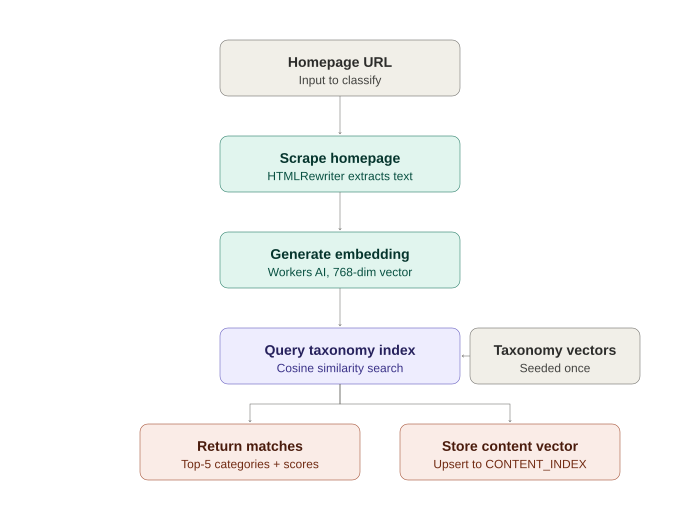

# IAB Taxonomy Classifier

A [Cloudflare Workers](https://developers.cloudflare.com/workers/) service that classifies website homepages using the [IAB Tech Lab Content Taxonomy](https://iabtechlab.com/standards/content-taxonomy/). The worker fetches a URL, embeds its content with [Workers AI](https://developers.cloudflare.com/workers-ai/), and returns the closest matching IAB categories via [Vectorize](https://developers.cloudflare.com/vectorize/) similarity search.

## How it works

Classification here isn't rule-based keyword matching — it's semantic similarity between vector embeddings.

**1. Taxonomy categories are embedded once, ahead of time.** Every category in the IAB Content Taxonomy (name + tier hierarchy, e.g. `"Amusement and Theme Parks: Attractions > Amusement and Theme Parks"`) is converted into a 768-dimensional vector using a Workers AI embedding model, and stored in a Vectorize index (`TAXONOMY_INDEX`). This is a one-time step (see [Seed the taxonomy](#seed-the-taxonomy)) — it only needs to be redone if the taxonomy changes or the embedding model changes.

**2. A homepage is scraped and embedded the same way.** When you classify a URL, the worker fetches the page, extracts its title, meta description, headings, and body text (via the native `HTMLRewriter` API, stripping scripts/styles/nav noise), and embeds that combined text using the *same* embedding model — so both taxonomy categories and page content live in the same vector space and can be meaningfully compared.

**3. The page's vector is compared against every taxonomy category.** Cosine similarity between the page's embedding and each stored category embedding produces a score from 0–1: the closer two vectors point in the same direction, the more semantically similar they are. The top 5 nearest categories are returned as `allMatches`; those clearing a similarity threshold are additionally surfaced as `confidentMatches`.

**4. The page's own vector is stored for reuse.** Beyond just returning a classification, the page's embedding is upserted into a second index (`CONTENT_INDEX`), keyed by a deterministic hash of the normalized URL. This means:
   - Re-classifying the same URL updates its existing entry rather than duplicating it.
   - If the taxonomy is later expanded or re-seeded, previously scraped content can be re-classified without re-fetching the page.
   - Stored content vectors can eventually be compared against each other (e.g. "find pages similar to this one"), independent of taxonomy matching.

### Diagrams

**Taxonomy index seeding** (one-time, run before the worker can classify anything):


**Classify request** (runs per URL, once the taxonomy index is seeded):



## Prerequisites

- [Node.js](https://nodejs.org/) 18 or later
- A [Cloudflare account](https://dash.cloudflare.com/sign-up)
- [Wrangler CLI](https://developers.cloudflare.com/workers/wrangler/) (included as a dev dependency)

## Getting started

```bash
npm install
```

Log in to Cloudflare (first time only):

```bash
npx wrangler login
```

### Create the Vectorize indexes

Before running or deploying the worker, create the two [Vectorize](https://developers.cloudflare.com/vectorize/) indexes configured in `wrangler.jsonc`. Index names must match `index_name` for each binding.

**IAB content taxonomy** (`TAXONOMY_INDEX`) — stores embeddings for IAB taxonomy categories:

```bash
npx wrangler vectorize create iab-content-taxonomy --dimensions=768 --metric=cosine
```

**Classified content** (`CONTENT_INDEX`) — stores embeddings for previously classified page content:

```bash
npx wrangler vectorize create classified-content --dimensions=768 --metric=cosine
```

The 768 dimensions match the embedding model used by Workers AI (`@cf/baai/bge-base-en-v1.5`). Both indexes must share the same dimensions and metric as each other, since page vectors and taxonomy vectors are compared directly against one another.

### Seed the taxonomy

The worker needs vector embeddings for every IAB taxonomy category before it can classify anything. A standalone script reads the official taxonomy TSV, calls the Workers AI API to generate embeddings, and writes them to `data/vectors.ndjson`.

**1. Configure environment variables**

Copy `.env.example` to `.env` and fill in your Cloudflare credentials and embedding settings:

```bash
cp .env.example .env
```

| Variable | Description |
|---|---|
| `CLOUDFLARE_ACCOUNT_ID` | Your Cloudflare account ID |
| `CLOUDFLARE_API_TOKEN` | API token with Workers AI + Vectorize permissions |
| `EMBEDDING_MODEL` | Workers AI embedding model (e.g. `@cf/baai/bge-base-en-v1.5`) |
| `EMBEDDING_DIMENSIONS` | Must match your Vectorize index dimensions (`768`) |

**2. Run the seed script**

The taxonomy file is already included at `data/content-taxonomy-3.1.tsv` (IAB Content Taxonomy v3.1). Run:

```bash
npx tsx scripts/seed-taxonomy.ts
```

The script processes each taxonomy row sequentially, embedding the category name and tier path (e.g. `Amusement and Theme Parks: Attractions > Amusement and Theme Parks`). Progress is logged every 50 rows. Output is written incrementally to `data/vectors.ndjson` as newline-delimited JSON, so a partial run isn't lost if the script is interrupted.

> **Note:** With ~700 categories and one API call per row, processed sequentially, the full run takes several minutes. Rate-limit responses (HTTP 429) are retried automatically; any rows that still fail after retries are listed in the summary at the end.

**3. Load embeddings into Vectorize**

Once `data/vectors.ndjson` has been generated, insert the vectors into the `iab-content-taxonomy` index:

```bash
npx wrangler vectorize insert iab-content-taxonomy --file=data/vectors.ndjson
```

Verify the import:

```bash
npx wrangler vectorize get iab-content-taxonomy
```

The vector count should match the number of rows in the taxonomy file (minus any that failed after retries).

### Local development

```bash
npx wrangler dev
```

The worker runs at `http://localhost:8787`. Vectorize bindings are configured with `remote: true` in `wrangler.jsonc`, so `AI` and both Vectorize indexes reach your real Cloudflare account even in local dev — only the request routing runs locally.

### Test the scraper in isolation

A temporary debug route (`GET /debug-scrape`) lets you exercise the homepage scraper before wiring up classification.

```bash
curl "http://localhost:8787/debug-scrape?url=https://example.com" | jq
```

Returns JSON with `title`, `description`, `headings`, `combinedText`, and the normalized `url`. On failure, the route responds with `502` and an `{ error, url }` body.

> **Note:** Remove or gate this route behind an environment check before deploying to production.

### Classify a URL

```bash
curl "http://localhost:8787/classify?url=https://example.com" | jq
```

**Response**

```json
{
  "url": "https://example.com",
  "title": "Example Domain",
  "allMatches": [
    { "id": "605", "score": 0.615, "name": "Shareware and Freeware", "tier1": "Technology & Computing" }
  ],
  "confidentMatches": [],
  "contentId": "100680ad546ce6a577f42f52df33b4cfdca756859e664b8d7de329b150d09ce9"
}
```

- `allMatches` — top 5 nearest taxonomy categories by cosine similarity.
- `confidentMatches` — subset of `allMatches` clearing the similarity threshold (currently 0.65 — under evaluation against real-world scores).
- `contentId` — deterministic hash of the normalized URL, used as the vector ID in `CONTENT_INDEX`; re-classifying the same URL overwrites rather than duplicates.

On failure (unreachable URL, non-HTML content, timeout), the route responds with `502` and an `{ error, url }` body.

### Deploy

```bash
npx wrangler deploy
```

## Project structure

```
data/
  content-taxonomy-3.1.tsv   # Official IAB Content Taxonomy v3.1 (input)
  vectors.ndjson              # Generated taxonomy embeddings (output from seed script)
docs/
  pipeline-seed.svg           # Diagram: taxonomy seeding pipeline
  pipeline-classify.svg       # Diagram: classify request pipeline
scripts/
  seed-taxonomy.ts            # Embeds taxonomy categories via Workers AI
src/
  index.ts                    # Worker entry point — request routing
  scrape.ts                   # Homepage fetch and HTML text extraction (HTMLRewriter)
  classify.ts                 # Scrape → embed → query taxonomy → store content vector
wrangler.jsonc                 # Cloudflare Worker configuration
```

## Related resources

- [IAB Tech Lab Content Taxonomy](https://iabtechlab.com/standards/content-taxonomy/)
- [Cloudflare Workers documentation](https://developers.cloudflare.com/workers/)
- [Cloudflare Workers AI documentation](https://developers.cloudflare.com/workers-ai/)
- [Cloudflare Vectorize documentation](https://developers.cloudflare.com/vectorize/)
- [Wrangler configuration reference](https://developers.cloudflare.com/workers/wrangler/configuration/)

## License

See repository license. The IAB Content Taxonomy is maintained by [IAB Tech Lab](https://iabtechlab.com/).
